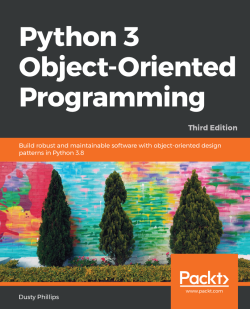

# Python 3 Object-Oriented Programming - Third Edition

This is the code that I've written while reading the great book [Python 3 Object-Oriented Programming - Third Edition](https://www.packtpub.com/product/python-3-object-oriented-programming-third-edition/9781789615852) by Dusty Phillips. 

The original repo with the code can be found [here](https://github.com/PacktPublishing/Python-3-Object-Oriented-Programming-Third-Edition).

*N.B.: BTW, I've just realized today (June 21, 2021) that a 4th edition is close (on sale next month, July'21)... XD. The repo corresponding to the 4th ed. can be found [here](https://github.com/PacktPublishing/Python-Object-Oriented-Programming---4th-edition).*
